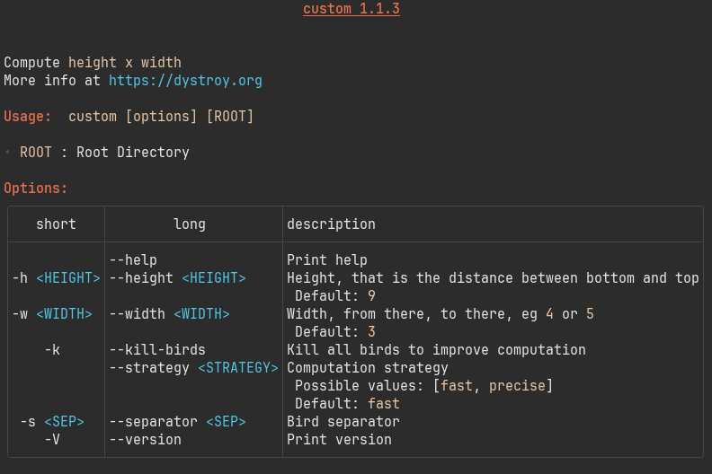

# clap-help

[![MIT][s2]][l2] [![Latest Version][s1]][l1] [![Chat on Miaou][s4]][l4]

[s1]: https://img.shields.io/crates/v/clap-help.svg
[l1]: https://crates.io/crates/clap-help

[s2]: https://img.shields.io/badge/license-MIT-blue.svg
[l2]: LICENSE

[s4]: https://miaou.dystroy.org/static/shields/room.svg
[l4]: https://miaou.dystroy.org/3768?rust

## Purpose and Features

**clap-help** prints the --help message of [clap](https://docs.rs/clap/) based terminal applications.

### Differences with the vanilla help renderer of the clap crate:

- more readable, thanks to a width aware layout
- much more compact: from 2 to 3 times less lines compared to vanilla
- options rendered in a balanced table, optimized for the width of the terminal
- introduction interpreted as Markdown, allowing lists, tables, code blocks, etc.
- doc of options interpreted as Markdown
- skin automatically selected for light or dark terminals
- customizable [termimad](https://github.com/Canop/termimad/) skin
- you can customize section templates, remove them, reorder them, add sections

**clap-help** is especially suited to small terminals or big numbers of options.

### Not (yet) supported:

- subcommands
- your use case, maybe, because clap-help hasn't been used in many programs and each one is different; come to the chat and ask if needed

## Comparison

This comparison uses the [broot](https://github.com/Canop/broot) program.

### With clap-help


### With the standard help rendering


*(my screen isn't big enough to fit even half the help page)*

## Usage

### Basic usage

Your program needs a clap `Command` defined.

Here's for example with clap-derive:

```rust
#[derive(Parser, Debug)]
#[command(name="area", author, version, about, disable_help_flag = true)]
struct Args {

    /// Print help
    #[arg(long)]
    help: bool,

    /// Height, that is the distance between bottom and top
    #[arg(short, long, default_value = "9")]
    height: u16,

    /// Width, from there, to there, eg `4` or `5`
    #[arg(short, long, default_value = "3")]
    width: u16,

    /// Kill all birds to improve computation
    #[arg(short, long)]
    kill_birds: bool,

    /// Computation strategy
    #[arg(long, default_value = "fast")]
    strategy: Strategy,

    /// Bird separator
    #[arg(short, long, value_name = "SEP")]
    separator: Option<String>,

    /// Root Directory
    pub root: Option<std::path::PathBuf>,
}
```

Notice
* the `disable_help_flag = true` disabling the standard behaviour of clap regarding help.
* the explicit `help` argument. Here it's with only `#[arg(long)]` because `-h` is used for something more important but you would most often have `#[arg(short, long)]`.

The help introduction (the part before usage) is defined as a string which will be interpreted as Markdown. It can contain tables, lists, bold, italic, inline code, code blocks, etc.

```rust
static INTRO: &str = "

Compute `height x width`
*You can do it either precisely (enough) or fast (I mean not too slow)*.
";
```

On program launch, you should check the value of the `help` flag and, if necessary, print the help:

```rust
let args = Args::parse();
if args.help {
    Printer::new(Args::command())
        .with("introduction", INTRO)
        .without("author")
        .print_help();
    return;
}
```

Help rendered in a light terminal:


Same help in a dark terminal:


Complete example is in `/examples/area` and can be seen with `cargo run --example area -- --help`

### Changing the skin

If your program has some kind of graphical identity, you may want to extend it to the help.

This is the case of [bacon](https://dystroy.org/bacon) which features this kind of saturated pink that kids associate to pigs.

This change was easily done by setting the [color](https://en.wikipedia.org/wiki/ANSI_escape_code#8-bit) of first level headers and bold:

```rust
let mut printer = clap_help::Printer::new(Args::command())
    .with("introduction", INTRO)
    .without("author");
let skin = printer.skin_mut();
skin.headers[0].compound_style.set_fg(ansi(204));
skin.bold.set_fg(ansi(204));
printer.print_help();
```

Result:


### Customizing more: changing both the skin and the templates

The example in `examples/custom` mainly features:

* less restreint on the colors
* a removal of the `value` column



The strategy for those changes is

* to redefine the `bold`, `italic`, and `inline_code` styles to change their foreground color, to remove the background of the code, and to remove the Italic attribute of `italic`
* to change the `"options"` template so that `${short}` and `${long}` are in italic (i.e. between stars in Markdown)
* to modify the template to remove the unwanted column

Here's the relevant parts of the code:


```rust
pub static TEMPLATE_OPTIONS: &str = "

**Options:**
|:-:|:-:|:-|
|short|long|what it does|
|:-:|:-|:-|
${option-lines
|*${short}*|*${long}*|${help}${possible_values}${default}|
}
|-
";
```

```rust
let mut printer = Printer::new(Args::command())
    .without("author")
    .with("introduction", INTRO)
    .with("options", TEMPLATE_OPTIONS);
let skin = printer.skin_mut();
skin.headers[0].compound_style.set_fg(ansi(202));
skin.bold.set_fg(ansi(202));
skin.italic = termimad::CompoundStyle::with_fg(ansi(45));
skin.inline_code = termimad::CompoundStyle::with_fg(ansi(223));
printer.print_help();
```

Complete example is in `/examples/custom` and can be seen with `cargo run --example custom -- --help`

Please note that not every customization is possible or easy with the current clap-help.
And some may be easy but not obvious.
Come to the chat and ask if needed.

