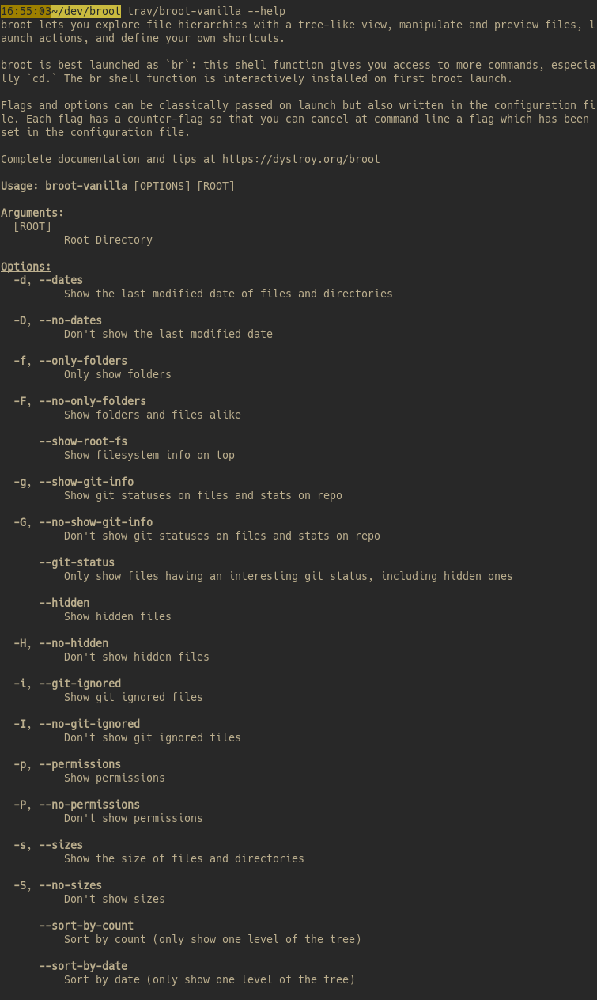

# clap-help

[![MIT][s2]][l2] [![Latest Version][s1]][l1] [![Chat on Miaou][s4]][l4]

[s1]: https://img.shields.io/crates/v/clap-help.svg
[l1]: https://crates.io/crates/clap-help

[s2]: https://img.shields.io/badge/license-MIT-blue.svg
[l2]: LICENSE

[s4]: https://miaou.dystroy.org/static/shields/room.svg
[l4]: https://miaou.dystroy.org/3768?rust

## Purpose and Features

**clap-help** prints the --help message of [clap](https://docs.rs/clap/) based terminal applications.

### Differences with the vanilla help renderer of the clap crate:

- more readable, thanks to a width aware layout
- much more compact: from 2 to 3 times less lines compared to vanilla
- options rendered in a balanced table, optimized for the width of the terminal
- introduction interpreted as Markdown, allowing lists, tables, code blocks, etc.
- skin automatically selected for light or dark terminals
- customizable [termimad](https://github.com/Canop/termimad/) skin
- (slightly) customizable templates

**clap-help** is especially suited to small terminals or big numbers of options.

### Not (yet) supported:

- subcommands
- your use case, maybe, because clap-help hasn't been used in many programs and each one is different; come to the chat and ask if needed

## Comparison

This comparison uses the [broot](https://github.com/Canop/broot) program.

### With clap-help


### With the standard help rendering



*(my screen isn't big enough to fit even half the help page)*

## Usage

Your program needs a clap `Command` defined.

Here's for example with clap-derive:


```rust
#[derive(Parser, Debug)]
#[command(name="area", author, version, about, disable_help_flag = true)]
struct Args {

    /// Print help
    #[arg(long)]
    help: bool,

    /// Height, that is the distance between bottom and top
    #[arg(short, long, default_value = "9")]
    height: u16,

    /// Width, from there, to there
    #[arg(short, long, default_value = "3")]
    width: u16,

    /// Computation strategy
    #[arg(short, long, default_value = "fast")]
    strategy: Strategy,

    /// Root Directory
    pub root: Option<std::path::PathBuf>,
}
```

Notice
* the `disable_help_flag = true` disabling the standard behaviour of clap regarding help.
* the explicit `help` argument. Here it's with only `#[arg(long)]` because `-h` is used for something more important but you would most ofte have `#[arg(short, long)]`.

The help introduction (the part before usage) is defined as a string which will be interpreted as Markdown. It can contain tables, lists, bold, italic, inline code, code blocks, etc.

```rust
static INTRO: &str = "
Compute height x width
*You can do it either precisely (enough) or fast (I mean not too slow)*.

";
```

On program launch, you should check the value of the `help` flag and, if necessary, print the help:

```rust
let args = Args::parse();
if args.help {
    Printer::new(Args::command())
        .with_introduction(INTRO)
        .print_help();
    return;
}
```

Help rendered in a light terminal:


Same help in a dark terminal:


Complete example is in `/examples/area`.
