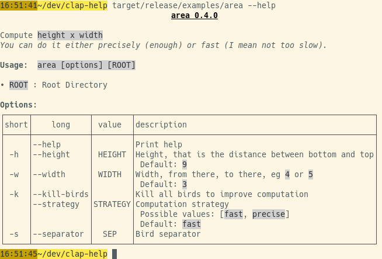
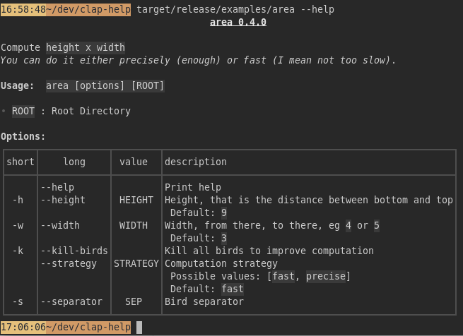

# clap-help

[![MIT][s2]][l2] [![Latest Version][s1]][l1] [![docs][s3]][l3] [![Chat on Miaou][s4]][l4]

[s1]: https://img.shields.io/crates/v/clap-help.svg
[l1]: https://crates.io/crates/clap-help

[s2]: https://img.shields.io/badge/license-MIT-blue.svg
[l2]: LICENSE

[s3]: https://docs.rs/clap-help/badge.svg
[l3]: https://docs.rs/clap-help/

[s4]: https://miaou.dystroy.org/static/shields/room.svg
[l4]: https://miaou.dystroy.org/3768?rust

## Purpose and Features

**clap-help** prints the --help message of [clap](https://docs.rs/clap/) based terminal applications.

### Differences with the vanilla help renderer of the clap crate:

- more readable, thanks to a width aware layout
- more compact: from 2 to 3 times less lines compared to vanilla
- options rendered in a balanced table, optimized for the width of the terminal
- introduction interpreted as Markdown, allowing lists, tables, code blocks, etc.
- doc of options interpreted as Markdown
- skin automatically selected for light or dark terminals
- customizable [termimad](https://github.com/Canop/termimad/) skin
- you can customize section templates, remove them, reorder them, add sections

Note: there's no support for subcommands yet.

## Example

The [bacon](https://dystroy.org/bacon) programs uses clap-help with an introduction text, a clearer options table, examples, and a skin consistent with the rest of the application:


How it's done: [https://github.com/Canop/bacon/blob/main/src/args.rs](https://github.com/Canop/bacon/blob/main/src/args.rs).

## Usage

### Basic usage

Your program needs a clap `Command` defined.

Here's for example with clap-derive:

```rust
#[derive(Parser, Debug)]
#[command(name="area", author, version, about, disable_help_flag = true)]
struct Args {

    /// Print help
    #[arg(long)]
    help: bool,

    /// Height, that is the distance between bottom and top
    #[arg(short, long, default_value = "9")]
    height: u16,

    /// Width, from there, to there, eg `4` or `5`
    #[arg(short, long, default_value = "3")]
    width: u16,

    /// Kill all birds to improve computation
    #[arg(short, long)]
    kill_birds: bool,

    /// Computation strategy
    #[arg(long, default_value = "fast")]
    strategy: Strategy,

    /// Bird separator
    #[arg(short, long, value_name = "SEP")]
    separator: Option<String>,

    /// Root Directory
    pub root: Option<std::path::PathBuf>,
}
```

Notice
* the `disable_help_flag = true` disabling the standard behaviour of clap regarding help.
* the explicit `help` argument. Here it's with only `#[arg(long)]` because `-h` is used for something more important but you would most often have `#[arg(short, long)]`.

The help introduction (the part before usage) is defined as a string which will be interpreted as Markdown. It can contain tables, lists, bold, italic, inline code, code blocks, etc.

```rust
static INTRO: &str = "

Compute `height x width`
*You can do it either precisely (enough) or fast (I mean not too slow)*.
";
```

On program launch, you should check the value of the `help` flag and, if necessary, print the help:

```rust
let args = Args::parse();
if args.help {
    Printer::new(Args::command())
        .with("introduction", INTRO)
        .without("author")
        .print_help();
    return;
}
```

Help rendered in a light terminal:



Same help in a dark terminal:



Complete example is in `/examples/area` and can be seen with `cargo run --example area -- --help`

### Adding custom sections

Help is usually easier to grasp with a few examples.
You can write a few ones in your intro, or you can add them in a later section, after the options.

It's also possible to leverage the template system, which is what is done in the `with-examples` example, for this result:


Here's how it's done:

```rust
static EXAMPLES_TEMPLATE: &str = "
**Examples:**

${examples
**${example-number})** ${example-title}: `${example-cmd}`
${example-comments}
}
";
```

```rust

let mut printer = clap_help::Printer::new(Args::command())
    .with("introduction", INTRO_TEMPLATE)
    .without("author");
printer.template_keys_mut().push("examples");
printer.set_template("examples", EXAMPLES_TEMPLATE);
for (i, example) in EXAMPLES.iter().enumerate() {
    printer
        .expander_mut()
        .sub("examples")
        .set("example-number", i + 1)
        .set("example-title", example.title)
        .set("example-cmd", example.cmd)
        .set_md("example-comments", example.comments);
}
printer.print_help();
```

[complete code of the example](examples/with-examples/main.rs)


### Changing the skin

If your program has some kind of graphical identity, you may want to extend it to the help.

You may change colors, preferably with more compatible [ansi color codes](https://en.wikipedia.org/wiki/ANSI_escape_code#8-bit).

See example in `examples/custom` mainly features:


The strategy for those changes is

* to redefine the `bold`, `italic`, and `inline_code` styles to change their foreground color, to remove the background of the code, and to remove the Italic attribute of `italic`
* to use the `TEMPLATE_OPTIONS_MERGED_VALUE` template for options

Here are the relevant parts of the code:


```rust
static INTRO: &str = "

Compute `height x width`
More info at *https://dystroy.org*
";

let mut printer = Printer::new(Args::command())
    .without("author")
    .with("introduction", INTRO)
    .with("options", clap_help::TEMPLATE_OPTIONS_MERGED_VALUE);
let skin = printer.skin_mut();
skin.headers[0].compound_style.set_fg(ansi(202));
skin.bold.set_fg(ansi(202));
skin.italic = termimad::CompoundStyle::with_fg(ansi(45));
skin.inline_code = termimad::CompoundStyle::with_fg(ansi(223));
skin.table_border_chars = termimad::ROUNDED_TABLE_BORDER_CHARS;
printer.print_help();
```

Complete example is in `/examples/custom` and can be seen with `cargo run --example custom -- --help`

Please note that not every customization is possible or easy.
And some may be easy but not obvious.
Come to [the chat](https://miaou.dystroy.org/3768?rust) and ask if needed.

